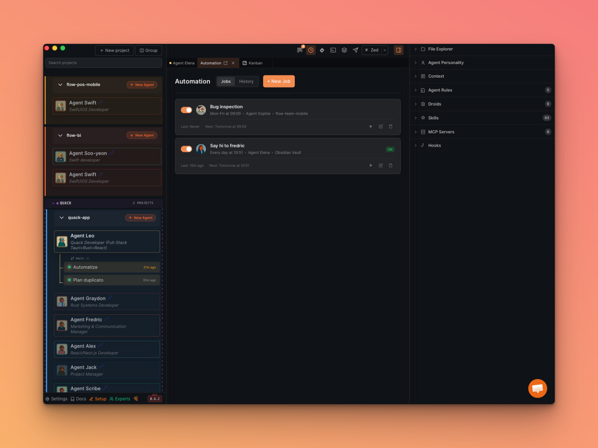
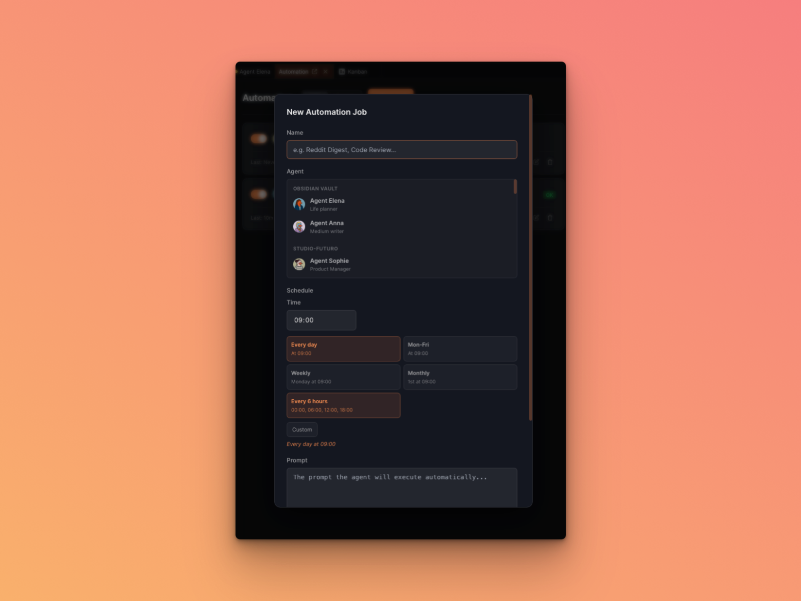
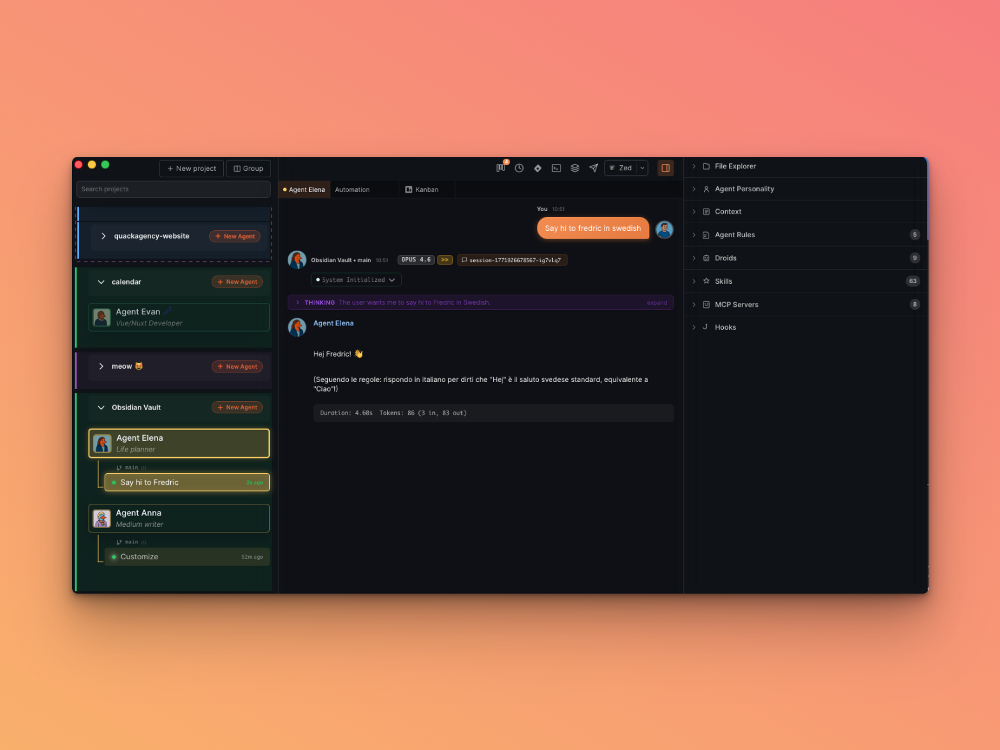

Automations let you schedule recurring AI agent sessions. Define a job once — pick an agent, set a cron schedule, write a prompt — and Quack will automatically create a new session and execute the prompt at the scheduled time.

## Use Cases

- **Daily digest**: An agent reads your favorite subreddits every morning and suggests what to reply to
- **Scheduled code review**: Run a weekly code quality check on your project
- **Bug inspection**: A Mon-Fri agent scans open issues and triages them
- **Content planning**: An agent reviews your editorial calendar daily and drafts posts

## Opening the Automation Tab

There are two ways to access Automations:

1. **Keyboard Shortcut**: Press `Cmd+J` (macOS) or `Ctrl+J` (Windows/Linux)
2. **Toolbar Button**: Click the clock icon in the top toolbar

The Automation tab opens alongside your other tabs (Chat, Kanban, etc.).

## Creating a Job

Click **+ New Job** to open the creation form.

### Job Fields

| Field | Description |
|-------|-------------|
| **Name** | A short label for the job (e.g. "Reddit Digest", "Code Review") |
| **Agent** | The AI agent that will execute the job. Agents are grouped by project — selecting an agent automatically sets the project. |
| **Schedule** | Choose a preset or write a custom cron expression. A preview shows when the next run will fire. |
| **Prompt** | The prompt the agent will execute automatically when the job fires. |

### Schedule Presets

| Preset | Cron Expression | Description |
|--------|----------------|-------------|
| Every day | `0 9 * * *` | At 09:00 every day |
| Mon-Fri | `0 9 * * 1-5` | At 09:00, Monday through Friday |
| Weekly | `0 9 * * 1` | Monday at 09:00 |
| Monthly | `0 9 1 * *` | 1st of the month at 09:00 |
| Every 6 hours | `0 */6 * * *` | 00:00, 06:00, 12:00, 18:00 |
| Custom | Any valid cron | Write your own 5-field cron expression |

All times use your **local system timezone** (macOS/Windows).

## How Jobs Execute

When a scheduled job fires:

1. Quack creates a new **Agent Session** under the target agent, titled `[Auto] Job Name`
2. The session appears in the sidebar under the agent, just like a manually created session
3. The prompt is sent automatically — the agent processes it and responds

You can click on the session to read the response, continue the conversation, or mark it as done.

## Managing Jobs

Each job card shows:

- **Toggle switch** — enable/disable the job without deleting it
- **Status badge** — Running, OK (last run succeeded), or Failed
- **Last run / Next run** — timestamps in your local timezone
- **Action buttons** — Play (fire now), Edit, Delete

### Fire Now

Click the **play button** on any job card to fire it immediately, regardless of schedule. This creates a session right away — useful for testing your prompt before waiting for the next scheduled run.

### Edit and Delete

Use the **edit button** to modify a job's name, schedule, agent, or prompt. Use the **delete button** to permanently remove a job. Deleting a job does not remove sessions that were already created by previous runs.

## History

Switch to the **History** tab to see a log of all past runs. Each entry shows:

- **Status indicator** — green (success), red (failed), blue (running)
- **Job name** and timestamp
- **Duration** of the run
- **Open session** link to navigate directly to the resulting conversation

## Tips

- Start with the **"Fire Now"** button to test your prompt before relying on the schedule
- Use **descriptive prompts** — the agent won't have previous context since each run creates a fresh session
- **Disable** jobs temporarily instead of deleting them if you want to pause a schedule
- Check the **History** tab to monitor that your automations are running as expected
