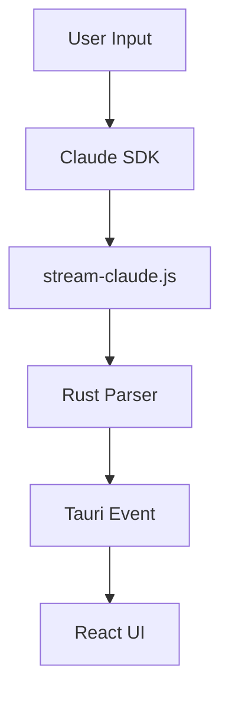

# Second Brain

Quack's Second Brain is a **two-level, file-based knowledge store** that helps your AI agents learn, remember, and recall. Every pattern discovered, bug fixed, and decision made gets saved as a simple markdown file — no database, no complexity, no vendor lock-in.

## Why a Second Brain?

Imagine this: your AI agent spends 20 minutes debugging a tricky race condition in your WebView. It finds the fix, applies it, and moves on. Three weeks later, a similar issue shows up in a different component. Without the Second Brain, the agent starts from scratch. With it? The agent finds the previous fix in seconds and applies the same approach.

**The Second Brain turns every debugging session into permanent knowledge.**

## Architecture: Two Levels

Your knowledge lives in two places, each serving a different purpose:

### Level 1: Project Documentation (Git-tracked)

```
your-project/documentation/
├── bugs/           # Bug fixes and root cause analysis
├── decisions/      # Architecture Decision Records
├── patterns/       # Reusable code patterns
├── gotchas/        # Pitfalls and "watch out for this"
├── diary/          # Daily activity logs
├── guide/          # Human-readable feature guides
├── inbox/          # Quick captures (mobile-friendly)
└── map.md          # Architecture navigation map
```

This lives **inside your project repo**. It gets committed, pushed, and shared with the team. When a teammate clones the repo, they get all the project knowledge for free.

### Level 2: Global Brain (Personal)

```
~/.quack/brain/
├── patterns/       # Cross-project patterns
├── preferences/    # Your personal preferences
├── people/         # Contacts and collaborators
├── tools/          # Tool configurations
└── diary/          # Personal daily logs
```

This lives on **your machine only**. It stores knowledge that spans multiple projects — like your preferred error handling pattern, or a React hook technique you use everywhere.

### How the Agent Decides Where to Save

| If the knowledge is... | Save to... |
|------------------------|------------|
| Specific to one project | `{project}/documentation/` |
| Useful across projects | `~/.quack/brain/` |
| A project architecture decision | `documentation/decisions/` |
| A personal preference | `~/.quack/brain/preferences/` |

## Knowledge Types

Each file has a YAML frontmatter that tells the agent (and the UI) what type of knowledge it contains:

| Type | Folder | When Saved | Example |
|------|--------|------------|---------|
| `bug_fix` | bugs/ | Non-trivial bug with root cause analysis | "WebView memory leak caused by unbounded event listeners" |
| `pattern` | patterns/ | Reusable technique worth remembering | "Debounced search with content index" |
| `decision` | decisions/ | Architecture choice with context and reasoning | "File-based brain over SQLite — zero corruption risk" |
| `gotcha` | gotchas/ | A "watch out!" that catches people off guard | "Mermaid securityLevel: 'strict' strips inline styles in production" |
| `diary` | diary/ | Daily activity log | "Fixed stamina bar, added zoom to diagrams" |
| `preference` | preferences/ | How you like things done (global only) | "Always use Tailwind, prefer functional components" |

### File Format

Every knowledge entry follows the same structure:

```markdown
---
type: bug_fix
project: quack-app
created: 2026-02-15
last_verified: 2026-02-15
tags: [react, webview, memory]
---
# Fix: WebView Memory Leak

## Problem
High CPU/RAM usage after extended sessions...

## Solution
Bounded event listeners with cleanup in useEffect...

## Key Insight
WebView doesn't garbage-collect detached listeners automatically.
```

### File Naming

Names MUST be explicit and self-descriptive. Someone should understand the content from the filename alone.

**Good**: `fix-webkit-memory-leak-unbounded-listeners.md`
**Bad**: `bug-fix-1.md`

## Diary: Your Project's Activity Log

The diary is a special knowledge type — a daily log of what happened on the project. Each day gets one file (`YYYY-MM-DD.md`) with bullet-point entries.

### Diary Format

```markdown
---
type: diary
project: quack-app
date: 2026-02-15
---
- [11:30] (Alek) Timeline search field: content index with useMemo filtering
- [12:00] (Alek) User profile in Settings: auto-injection into CLAUDE.md
- [12:15] (Marco) Fixed login redirect: was missing await on auth check
```

Each bullet follows the format: `- [HH:MM] (Author) WHAT + KEY INSIGHT`

- **Time**: The agent runs `date +%H:%M` to get your local time — no invented timestamps
- **Author**: Read from your `**Name**:` setting in `~/.claude/CLAUDE.md` (set it in Quack Settings > General > Display Name)
- **Why this matters**: When multiple people work on a project, you can see exactly who did what and when

### Setting Up Your Display Name

1. Open Quack Settings (gear icon)
2. Go to **General** tab
3. Fill in your **Display Name** (e.g., "Alek", "Marco")
4. This name is automatically injected into `~/.claude/CLAUDE.md` so every AI agent knows who you are

## Mermaid Diagrams (.mmd)

The Second Brain supports **Mermaid diagrams** alongside markdown files. These are `.mmd` files with plain Mermaid syntax — no frontmatter needed.



Diagrams are rendered visually in the Brain UI with zoom, pan, and dark theme support. They're perfect for:

- **Architecture flows**: How data moves through your system
- **State machines**: Process states and transitions
- **Sequence diagrams**: API call chains
- **Entity relationships**: Database or component models

**Save diagrams** anywhere in `documentation/` or `guide/{feature}/`. They appear automatically in the Brain UI with a `[Diagram]` prefix in the sidebar.

## Brain Breadcrumbs

When your AI agent writes code related to a Brain entry, it leaves a **breadcrumb comment** linking back to the knowledge:

```typescript
// Brain: fix-webkit-memory-leak-unbounded-listeners
useEffect(() => {
  const handler = (e: Event) => { /* ... */ };
  webview.addEventListener('message', handler);
  return () => webview.removeEventListener('message', handler);
}, []);
```

This creates a **two-way connection**:
- **Brain → Code**: The entry's "Related Files" section lists affected files
- **Code → Brain**: The inline comment points back to the explanation

When you or another developer encounters this code later, the breadcrumb tells them exactly where to find the full context.

## Human Guides vs AI Knowledge

Your `documentation/` folder contains two types of content, each for a different audience:

| Audience | Location | Style | Purpose |
|----------|----------|-------|---------|
| **Humans** | `guide/{feature}/` | Narrative, tutorial-style, conversational | "Here's how Brain works and why..." |
| **AI** | `bugs/`, `patterns/`, `decisions/`, `gotchas/` | Structured YAML frontmatter + technical details | Quick-reference entries for agent search |

The Brain UI shows these in separate sections with clear labels so you always know who the content is written for.

## How the Agent Uses the Brain

### The Access Chain (Search Before Acting)

Every time an agent starts working, it follows a strict search priority:

1. **CLAUDE.md** — Always loaded. Contains links to critical gotchas and patterns
2. **Project documentation/** — Read `map.md` first, then search by topic
3. **Global `~/.quack/brain/`** — Only if project docs don't cover it

This means the agent never starts from zero. It always checks existing knowledge before exploring the codebase.

### Auto-Learn (Save After Discovering)

After completing a task, the agent evaluates whether something is worth saving using four criteria:

1. **Genuine discovery?** Not just a docs lookup
2. **Useful in 6 months?** Will someone hit this again?
3. **Verified solution?** Tested and confirmed working
4. **Clear trigger conditions?** When would someone need this?

**All four must be true** to save. This prevents brain pollution — only real, verified, useful knowledge gets stored.

## The Brain UI

Quack includes a **dedicated Brain window** where you can visually browse, search, and manage all your knowledge. It shows:

- **Knowledge sidebar**: All entries organized by type, with audience badges
- **Visual editor**: Read any entry with syntax highlighting and Mermaid rendering
- **Interactive graph**: See connections between entries as a node map
- **Timeline**: Activity feed with search, type filters, and author attribution

For full details, see [Brain UI](./brain-ui) and [Brain Timeline](./brain-timeline).

## Migrating from an Older Setup

If you have existing knowledge in `~/.quack/brain/` (the old flat structure), loose markdown files, or `.claude/docs/`, you can use the **Brain Migrate** skill to automatically reorganize everything into the v2 structure.

For migration instructions, see [Brain Migration](./brain-migration).

## Best Practices

### For Users

- **Set your Display Name** in Settings > General — enables diary attribution
- Keep brain location backed up (Dropbox, iCloud, or Git)
- Review diary entries weekly to track progress
- Use `inbox/` for quick mobile captures via Obsidian
- Keep `map.md` updated as your architecture evolves

### For Teams

- Commit `documentation/` to your repo — knowledge travels with code
- Each team member sets their Display Name — diary shows who did what
- Use decisions/ for Architecture Decision Records (ADRs) so choices are documented
- Brain breadcrumbs link code to context — future developers will thank you

---

**Next**: [Brain UI](./brain-ui) — Visual knowledge browser with graph, timeline, and search

**Previous**: [Kanban Board](./kanban-board) — Visual task management
